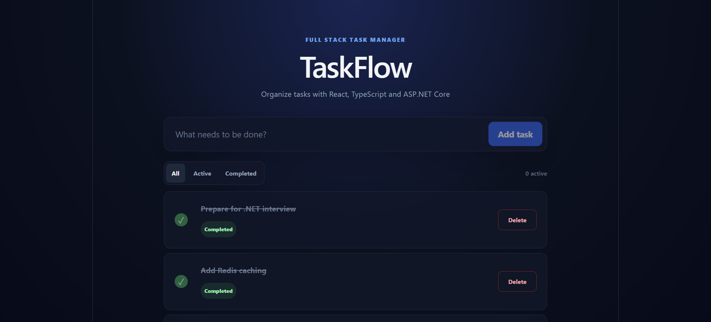
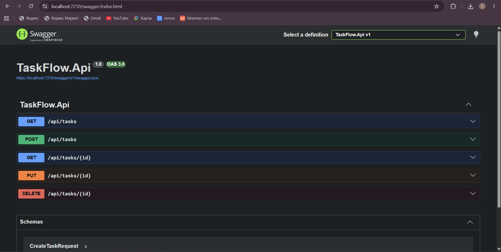
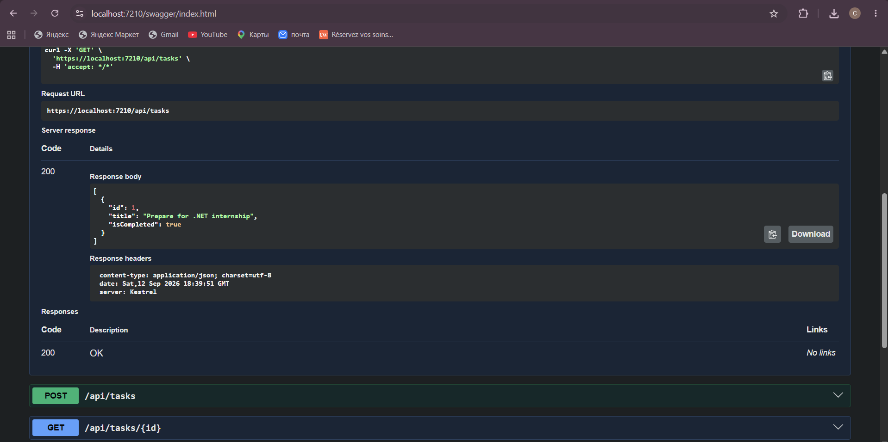
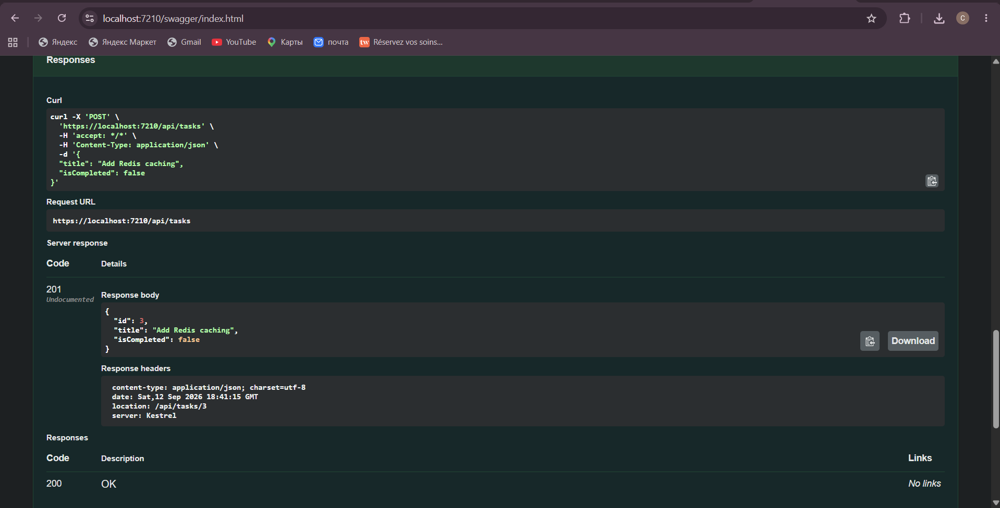

# TaskFlow

Full-stack task management application built with **React, TypeScript and ASP.NET Core**.

TaskFlow demonstrates a modern frontend architecture, REST API integration, PostgreSQL persistence, Redis caching and containerized infrastructure.



## Features

### Frontend

- Create tasks
- Complete tasks
- Delete tasks
- Filter by All / Active / Completed
- Active task counter
- Loading, error and empty states
- Responsive UI
- Client-side routing
- Server-state management and caching with TanStack Query
- Environment-based API configuration

### Backend

- REST API with ASP.NET Core
- CRUD operations
- PostgreSQL persistence with Entity Framework Core
- Redis caching
- Cache invalidation after data changes
- MediatR for application commands
- Background service for task statistics
- Swagger / OpenAPI documentation
- Unit tests with xUnit
- Dockerized infrastructure

## Tech Stack

### Frontend

- React
- TypeScript
- Vite
- TanStack Query
- React Router
- CSS
- ESLint

### Backend

- C#
- .NET 9
- ASP.NET Core
- Entity Framework Core
- MediatR
- PostgreSQL
- Redis
- Swagger / OpenAPI
- xUnit

### DevOps & Tools

- Docker
- Docker Compose
- Git
- GitHub

## Architecture

```text
React + TypeScript
        |
        | HTTP / REST
        v
ASP.NET Core API
        |
        +------> Redis Cache
        |
        +------> PostgreSQL
```

The frontend is separated into pages, reusable UI components, API services and TypeScript models.

```text
taskflow-client/src/
├── api/
│   └── tasks.ts
├── components/
│   ├── TaskFilter.tsx
│   ├── TaskForm.tsx
│   └── TaskItem.tsx
├── pages/
│   ├── TasksPage.tsx
│   └── NotFoundPage.tsx
├── types/
│   └── task.ts
├── App.tsx
└── main.tsx
```

TanStack Query manages asynchronous server state and synchronizes the UI with the backend after mutations.

The backend uses PostgreSQL as persistent storage. Redis implements caching for task-list requests, with cache invalidation after create, update and delete operations.

## API

| Method | Endpoint | Description |
|---|---|---|
| GET | `/api/tasks` | Get all tasks |
| GET | `/api/tasks/{id}` | Get task by ID |
| POST | `/api/tasks` | Create a task |
| PUT | `/api/tasks/{id}` | Update a task |
| DELETE | `/api/tasks/{id}` | Delete a task |

## API Demo

### Swagger



### Getting tasks



### Creating a task



## Run locally

### Requirements

- .NET 9 SDK
- Node.js
- Docker
- Docker Compose

### 1. Start infrastructure

```bash
docker compose up -d
```

### 2. Start backend

```bash
cd TaskFlow.Api
dotnet run
```

### 3. Configure frontend

Inside `taskflow-client`, create `.env` based on `.env.example`:

```env
VITE_API_URL=http://localhost:5019/api/tasks
```

### 4. Start frontend

```bash
cd taskflow-client
npm install
npm run dev
```

Open:

```text
http://localhost:5173
```

## Quality checks

Frontend:

```bash
npm run build
npm run lint
```

Backend tests:

```bash
dotnet test
```

## Project purpose

TaskFlow was created as a portfolio full-stack project to practice building an application across the entire stack: frontend architecture, typed API integration, backend development, database persistence, caching, testing and containerized infrastructure.